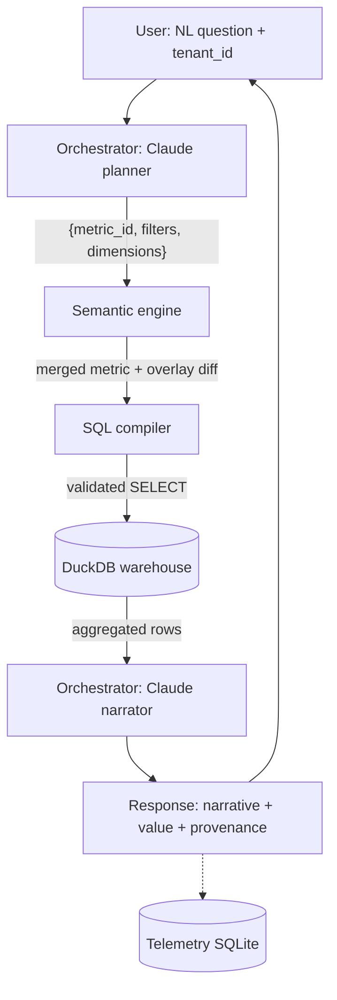

# Illuminate Two-Tier Semantic Layer Prototype

A laptop-only prototype that demonstrates Illuminate's two-tier AI semantic layer architecture: a canonical vendor model carries domain expertise across all customers; per-institution overlay YAMLs carry each campus's policy reality. The same natural-language question against the same data returns the institution's own answer, using the institution's own definition, with full provenance surfaced at every step — no row-level student data ever reaches the LLM.

## The architectural idea

Higher-ed institutions define the same terms differently — "retention," "FTE," "active student," "course completion" — each tied to local policy, accreditation regime, and registrar practice. A single canonical semantic layer cannot survive contact with a real customer base. The answer is two layers:

1. **Canonical layer.** Vendor-owned, opinionated metric definitions over a curated data model.
2. **Institutional overlay.** Per-tenant overrides or refinements that reference canonical objects by ID.

The AI agent resolves against the canonical layer first, applies the overlay, and surfaces provenance at every step. Aggregated results only ever reach the LLM — never row-level student data.

## Flow



## Quickstart

```bash
make setup                        # uv sync --extra dev
make data                         # seed DuckDB with synthetic students/terms/enrollments
uv run pytest -q                  # 26 tests pass

make demo                         # side-by-side comparison table (glossary fallback — no API key needed)

export ANTHROPIC_API_KEY=sk-...   # for narratives + Claude planner
uv run semantic-layer ask --tenant lone-star "what's our retention rate?"
make demo                         # now uses the Claude orchestrator

make run-api                      # → http://localhost:8000 (FastAPI + vanilla-JS UI)
```

## Architecture in 5 sentences

**Canonical YAML metrics** (`canonical/metrics.yaml`) define 7 metrics — retention, FTE, active students, course completion, at-risk count, average time to degree, DFW rate — each with Jinja-templated SQL, provenance fields, and example questions.
**Per-tenant overlay YAMLs** (`tenants/*/overlay.yaml`) override only the fields that differ: Lone Star rewrites retention to degree-seeking + fall-to-fall; Midwest State changes the FTE divisor from 12 to 15 and excludes audit enrollments from the completion-rate denominator.
**The engine** (`semantic_layer/engine.py`) loads and merges canonical + overlay into a `MergedMetric`, compiles Jinja SQL through sqlglot with a SELECT-only guard, and records `applied_definition` ("canonical" or "tenant-override") as structural provenance.
**The two-pass Claude orchestrator** (`semantic_layer/orchestrator.py`) runs a planner call that returns a validated `QueryPlan` (metric_id + filters + dimensions), executes the SQL, then runs a narrator call on aggregated rows only — PII never reaches the LLM; Anthropic is mocked in tests so CI runs offline.
**SQLite telemetry** (`semantic_layer/telemetry.py`) logs every query; a FastAPI service (`semantic_layer/api.py`) exposes `/ask`, `/tenants`, `/metrics`, and a root endpoint serving a single-page JS UI.

## Sample demo output

Run `make demo` (no API key required):

```text
                   Same question — different correct answers
┏━━━━━━━━━━━━━┳━━━━━━━━━━━━━━━┳━━━━━━━━━━━━━━━━━━━━━━━━━┳━━━━━━━━━━━━━━━━━━━━┳━━━━━━━━━━━━━━━━━━━━━━━━━━━━━━━━━━━━━━━━━━━━━━┓
┃ scenario    ┃ tenant        ┃ applied_definition      ┃ lead value         ┃ owner                                        ┃
┡━━━━━━━━━━━━━╇━━━━━━━━━━━━━━━╇━━━━━━━━━━━━━━━━━━━━━━━━━╇━━━━━━━━━━━━━━━━━━━━╇━━━━━━━━━━━━━━━━━━━━━━━━━━━━━━━━━━━━━━━━━━━━━━┩
│ retention   │ canonical     │ canonical               │ 74.42%             │ Illuminate Data Product                      │
│ retention   │ lone-star     │ tenant-override         │ 55.28%             │ Lone Star Registrar's Office                 │
│ retention   │ midwest-state │ canonical               │ 74.42%             │ Illuminate Data Product                      │
│ fte         │ canonical     │ canonical               │ 1163.92 (term_2024F) │ Illuminate Data Product                    │
│ fte         │ lone-star     │ canonical               │ 1163.92 (term_2024F) │ Illuminate Data Product                    │
│ fte         │ midwest-state │ tenant-override         │ 931.13 (term_2024F) │ Midwest State Office of Institutional Research │
│ persistence │ canonical     │ no-match                │ —                  │ —                                            │
│ persistence │ lone-star     │ tenant-override         │ 55.28%             │ Lone Star Registrar's Office                 │
│ persistence │ midwest-state │ no-match                │ —                  │ —                                            │
│ completion  │ canonical     │ canonical               │ 87.85% (term_2024F) │ Illuminate Data Product                    │
│ completion  │ lone-star     │ canonical               │ 87.85% (term_2024F) │ Illuminate Data Product                    │
│ completion  │ midwest-state │ tenant-override         │ 87.81% (term_2024F) │ Midwest State Office of Institutional Research │
└─────────────┴───────────────┴─────────────────────────┴────────────────────┴──────────────────────────────────────────────┘
         lead value = first-term row; per-term metrics will vary by term

─────────────────────────── Scenario notes ────────────────────────────────────
retention   — Lone Star restricts to degree-seeking + fall-to-fall; Midwest State uses canonical.
fte         — Midwest State divides credit-hours by 15; canonical and Lone Star use 12.
persistence — Lone Star's local glossary maps 'persistence' to retention; the others do not.
completion  — Midwest State excludes audit enrollments from the denominator.
```

Key observations:
- **retention**: Lone Star's degree-seeking + fall-to-fall definition yields 55.28% vs the canonical 74.42% — a 19-point gap from policy, not data quality.
- **fte**: Midwest State's R1 convention (÷15 vs canonical ÷12) produces a lower FTE count from the same credit hours.
- **persistence**: Only Lone Star resolves this term — its local glossary maps "persistence" to the retention metric; canonical and Midwest State return no-match, exactly as intended.
- **completion**: The 0.04-point difference comes from Midwest State excluding audit-enrollment rows from the denominator.

## Where to look

| File | Purpose |
|------|---------|
| `canonical/metrics.yaml` | The canonical metric library (7 metrics) |
| `tenants/*/overlay.yaml` | Tenant-specific overrides |
| `tenants/*/glossary.yaml` | Tenant-local synonym mappings |
| `semantic_layer/engine.py` | Merge + compile core — the heart of the system |
| `semantic_layer/orchestrator.py` | Two-pass Claude planner + narrator |
| `demo/scenarios.yaml` | Scripted demo questions |
| `THOUGHTS.md` | Decisions, corner-cuts, and closing reflections |
| `docs/superpowers/plans/2026-05-21-illuminate-semantic-layer-prototype.md` | The implementation plan executed |

## Limits of the prototype

- **Single warehouse, no dialect switching.** Everything runs against a local DuckDB file. Production would target Snowflake / BigQuery / Trino via a dialect-aware compiler.
- **No real tenant isolation.** The `--tenant` flag is trusted. Production needs RLS or ABAC.
- **In-memory cache only.** No Redis, no distributed invalidation.
- **YAML overlay format.** Human-editable and diffable, but production needs a registry service + diff UI.
- **LIMIT injection is string-scan, not AST-aware.**

See `THOUGHTS.md` for the full list of intentional corner-cuts and what a production system would change.
