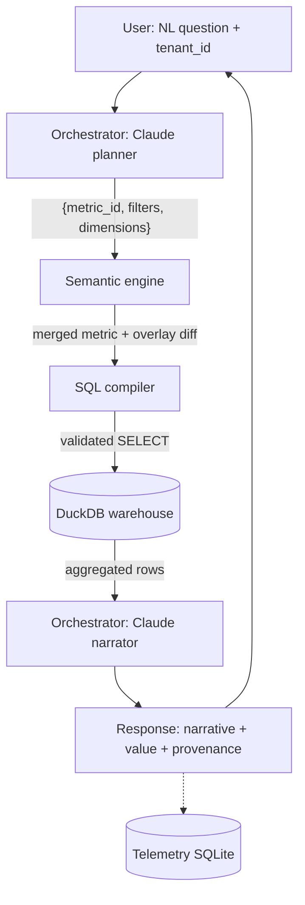

# Illuminate Two-Tier Semantic Layer Prototype

A laptop-only prototype demonstrating Illuminate's two-tier AI semantic layer architecture: a canonical vendor model carries the domain expertise; per-institution overlays carry each campus's policy reality. The same natural-language question against the same data returns the institution's own answer, with the institution's own definition surfaced as provenance.

## The architectural idea

Higher-ed institutions define the same terms differently — "retention," "FTE," "active student," "course completion" — each tied to local policy, accreditation regime, and registrar practice. A single canonical semantic layer cannot survive contact with a real customer base. The answer is two layers:

1. **Canonical layer.** Vendor-owned, opinionated metric definitions over a curated data model.
2. **Institutional overlay.** Per-tenant overrides or refinements that reference canonical objects by ID.

The AI agent resolves against the canonical layer first, applies the overlay, and surfaces provenance at every step. Aggregated results only ever reach the LLM — never row-level student data.

## Flow



## Quickstart

```bash
make setup
make data
export ANTHROPIC_API_KEY=sk-...
uv run semantic-layer ask --tenant lone-star "what's our retention rate?"
make demo
make run-api   # then open http://localhost:8000
```

## Status

Phase 1 (foundation + canonical end-to-end) in progress. See `docs/superpowers/plans/` for the implementation plan and `THOUGHTS.md` for decisions and intentional corner-cuts.
