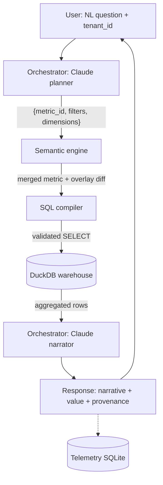

# Illuminate Two-Tier Semantic Layer Prototype — Implementation Plan

> **For agentic workers:** REQUIRED SUB-SKILL: Use superpowers:subagent-driven-development (recommended) or superpowers:executing-plans to implement this plan task-by-task. Steps use checkbox (`- [ ]`) syntax for tracking.

**Goal:** Build a working laptop-only prototype demonstrating a two-tier AI semantic layer (canonical vendor metrics + per-institution overlay) for higher-ed analytics, where the same natural-language question against the same data produces different correct answers per tenant with full provenance visible.

**Architecture:** Local Python service. DuckDB holds a synthetic higher-ed warehouse. A semantic engine loads canonical YAML metrics and merges per-tenant YAML overlays into `MergedMetric` objects (immutable canonical + overlay diff recorded). A two-pass orchestrator using Claude Sonnet 4.6 plans (NL → `{metric_id, filters, dimensions}`) then narrates (aggregated rows → prose). SQL is compiled with Jinja, validated with sqlglot (SELECT-only, LIMIT 10000 injected), executed against DuckDB. Telemetry logs every query to SQLite. CLI + tiny FastAPI/HTML UI are the demo surfaces.

**Tech Stack:** Python 3.12 (pyenv), uv, DuckDB, pydantic v2, pyyaml, Jinja2, sqlglot, anthropic SDK (`claude-sonnet-4-6`), FastAPI, uvicorn, typer, sqlite3 (stdlib), pytest, ruff.

---

## Phase Map and Check-in Points

- **Phase 1 (Tasks 1-4): foundation through canonical end-to-end.** Detailed below. **Stop and check in with the user after Task 4.**
- **Phase 2 (Tasks 5-7): overlay → orchestrator → second tenant + UI + telemetry.** Outlined below; expanded into full task detail after Phase 1 review.

---

## File Structure (locked in here)

```
illuminate-semantic-layer-prototype/
├── pyproject.toml                       # uv-managed, Python 3.12 pinned
├── .python-version                      # 3.12.x (pyenv)
├── Makefile                             # setup, data, demo, test, lint, run
├── README.md                            # architecture + Mermaid diagram + how to run
├── THOUGHTS.md                          # decisions + intentional corner-cuts
├── .gitignore                           # __pycache__, .venv, *.duckdb, *.db, .env
├── semantic_layer/
│   ├── __init__.py
│   ├── models.py                        # pydantic: Metric, Dimension, Overlay, MergedMetric, QueryPlan, QueryResult
│   ├── warehouse.py                     # DuckDB connection mgr + schema DDL + query executor
│   ├── engine.py                        # YAML loaders, overlay merger, metric resolver, SQL compiler (Jinja + sqlglot safety)
│   ├── orchestrator.py                  # two-pass Claude planner+narrator (Phase 2)
│   ├── telemetry.py                     # SQLite event log (Phase 2)
│   ├── cli.py                           # typer entrypoint
│   ├── api.py                           # FastAPI app (Phase 2)
│   └── prompts/
│       ├── plan.md                      # system prompt for the planner pass (Phase 2)
│       └── narrate.md                   # system prompt for the narrator pass (Phase 2)
├── canonical/
│   ├── entities.yaml                    # Student, Course, Section, Enrollment, Term, Activity, Program
│   ├── metrics.yaml                     # canonical metric definitions (start with 2; expand to 7)
│   └── glossary.yaml                    # canonical synonyms
├── tenants/
│   ├── lone-star/                       # community-college archetype
│   │   ├── tenant.yaml
│   │   ├── overlay.yaml
│   │   └── glossary.yaml
│   └── midwest-state/                   # R1 archetype (Phase 2)
│       ├── tenant.yaml
│       ├── overlay.yaml
│       └── glossary.yaml
├── data/
│   ├── generate.py                      # deterministic synthetic data generator
│   └── seed.duckdb                      # built by `make data`; gitignored
├── ui/
│   └── index.html                       # vanilla JS + fetch (Phase 2)
├── tests/
│   ├── __init__.py
│   ├── test_engine.py                   # canonical metric resolution
│   ├── test_overlay_merge.py            # overlay merge semantics
│   └── test_sql_compile.py              # Jinja compile + sqlglot safety
└── demo/
    └── scenarios.yaml                   # scripted demo questions (Phase 2)
```

**Responsibility boundaries:**
- `models.py` is the type vocabulary — nothing else defines pydantic models.
- `engine.py` owns YAML I/O, merging, and SQL compilation. It does not call Claude and does not talk to DuckDB directly (it returns SQL strings).
- `warehouse.py` owns DuckDB. It does not know about metrics.
- `orchestrator.py` is the only file that imports `anthropic`.
- `cli.py` and `api.py` are thin: they compose engine + warehouse + orchestrator + telemetry.

---

# Phase 1 — Foundation through canonical end-to-end

## Task 1: Project scaffold (pyproject, Makefile, README skeleton, .gitignore, .python-version)

**Files:**
- Create: `pyproject.toml`
- Create: `Makefile`
- Create: `README.md`
- Create: `THOUGHTS.md`
- Create: `.gitignore`
- Create: `.python-version`

- [ ] **Step 1: Write `.python-version`**

Content:
```
3.12
```

- [ ] **Step 2: Write `.gitignore`**

Content:
```
__pycache__/
*.pyc
.venv/
.uv/
*.duckdb
*.db
.env
.ruff_cache/
.pytest_cache/
dist/
build/
*.egg-info/
```

- [ ] **Step 3: Write `pyproject.toml`**

Content (uv-managed, Python 3.12, pinned versions of major libs):
```toml
[project]
name = "illuminate-semantic-layer-prototype"
version = "0.1.0"
description = "Two-tier AI semantic layer prototype for higher-ed analytics (canonical + per-institution overlay)."
requires-python = ">=3.12,<3.13"
dependencies = [
    "duckdb>=1.1.0",
    "pydantic>=2.8.0",
    "pyyaml>=6.0.2",
    "jinja2>=3.1.4",
    "sqlglot>=25.0.0",
    "anthropic>=0.40.0",
    "fastapi>=0.115.0",
    "uvicorn>=0.30.0",
    "typer>=0.12.0",
    "rich>=13.7.0",
    "faker>=30.0.0",
]

[project.optional-dependencies]
dev = [
    "pytest>=8.3.0",
    "ruff>=0.6.0",
]

[project.scripts]
semantic-layer = "semantic_layer.cli:app"

[build-system]
requires = ["hatchling"]
build-backend = "hatchling.build"

[tool.hatch.build.targets.wheel]
packages = ["semantic_layer"]

[tool.ruff]
line-length = 100
target-version = "py312"

[tool.ruff.lint]
select = ["E", "F", "I", "B", "UP"]
```

- [ ] **Step 4: Write `Makefile`**

Content:
```makefile
.PHONY: setup data demo test lint run-api clean

PY := python

setup:
	uv venv --python 3.12
	uv pip install -e ".[dev]"

data:
	uv run $(PY) -m data.generate

demo:
	uv run semantic-layer demo

test:
	uv run pytest -q

lint:
	uv run ruff check semantic_layer tests data
	uv run ruff format --check semantic_layer tests data

format:
	uv run ruff format semantic_layer tests data

run-api:
	uv run uvicorn semantic_layer.api:app --reload --port 8000

clean:
	rm -rf .venv .ruff_cache .pytest_cache dist build *.egg-info
	rm -f data/seed.duckdb telemetry.db
```

- [ ] **Step 5: Write `README.md` skeleton**

Content (300 words target, with Mermaid diagram):
```markdown
# Illuminate Two-Tier Semantic Layer Prototype

A laptop-only prototype demonstrating Illuminate's two-tier AI semantic layer architecture: a canonical vendor model carries the domain expertise; per-institution overlays carry each campus's policy reality. The same natural-language question against the same data returns the institution's own answer, with the institution's own definition surfaced as provenance.

## The architectural idea

Higher-ed institutions define the same terms differently — "retention," "FTE," "active student," "course completion" — each tied to local policy, accreditation regime, and registrar practice. A single canonical semantic layer cannot survive contact with a real customer base. The answer is two layers:

1. **Canonical layer.** Vendor-owned, opinionated metric definitions over a curated data model.
2. **Institutional overlay.** Per-tenant overrides or refinements that reference canonical objects by ID.

The AI agent resolves against the canonical layer first, applies the overlay, and surfaces provenance at every step. Aggregated results only ever reach the LLM — never row-level student data.

## Flow



## Quickstart

```bash
make setup
make data
export ANTHROPIC_API_KEY=sk-...
uv run semantic-layer ask --tenant lone-star "what's our retention rate?"
make demo
make run-api   # then open http://localhost:8000
```

## Status

Phase 1 (foundation + canonical end-to-end) in progress. See `docs/superpowers/plans/` for the implementation plan and `THOUGHTS.md` for decisions and intentional corner-cuts.
```

- [ ] **Step 6: Write `THOUGHTS.md` skeleton**

Content:
```markdown
# Decisions and Intentional Corner-Cuts

Running log of design decisions and the spots where the prototype deliberately departs from what production would require.

## Decisions

- **DuckDB over real warehouse.** Single-file, embedded, no ops. Production would target Snowflake/BigQuery/Databricks via dialect-aware SQL generation in `engine.py`.
- **YAML for canonical + overlay.** Human-editable, diffable in PRs. Production would back this with a registry service + UI, but the file format can stay similar.
- **In-process orchestrator.** Production would expose the engine as an MCP server so multiple agents (and the agentic IDE) can use it. The split point is clean: `engine.py` already returns SQL strings, so wrapping it as MCP tools is mechanical.
- **Two-pass Claude (plan → narrate).** Separating structured planning from prose composition lets us validate the plan before any DB call and lets us assert "no PII to the narrator" structurally.

## Intentional corner-cuts

- No real tenant isolation — `--tenant` flag is trusted.
- In-memory cache only; no Redis.
- Test coverage scoped to overlay merge + metric resolution + SQL safety.
- Web UI is one HTML file. Default styling.
- No Bedrock; direct Anthropic API.
```

- [ ] **Step 7: Initialize the virtualenv and verify installs**

Run:
```bash
make setup
```
Expected: `.venv/` created with Python 3.12, all deps installed without resolver conflicts.

- [ ] **Step 8: Commit the scaffold**

(No git repo yet — initialize one first.)
```bash
git init
git add .python-version .gitignore pyproject.toml Makefile README.md THOUGHTS.md docs/
git commit -m "chore: project scaffold (pyproject, Makefile, README skeleton)"
```

---

## Task 2: Synthetic data generator + DuckDB schema

**Files:**
- Create: `data/__init__.py`
- Create: `data/generate.py`
- Create: `semantic_layer/__init__.py`
- Create: `semantic_layer/warehouse.py`

**Schema decisions (locked in here so engine + metrics can rely on them):**

- `terms(term_id PK, name, start_date, end_date, ordinal)` — Fall 2024, Spring 2025, Fall 2025, Spring 2026.
- `programs(program_id PK, name, level)` — level ∈ {`undergrad`, `grad`, `certificate`}.
- `students(student_id PK, first_enroll_term_id FK, program_id FK, is_degree_seeking BOOL, classification)` — classification ∈ {`first_year`, `sophomore`, `junior`, `senior`, `grad`, `non_degree`}.
- `courses(course_id PK, subject, number, title, credit_hours)`.
- `sections(section_id PK, course_id FK, term_id FK)`.
- `enrollments(enrollment_id PK, student_id FK, section_id FK, term_id FK, enrollment_type, final_grade, credit_hours)` — enrollment_type ∈ {`credit`, `audit`}; final_grade ∈ {`A`,`B`,`C`,`D`,`F`,`W`,NULL} where NULL = in-progress.
- `activity(activity_id PK, student_id FK, term_id FK, activity_date, kind)` — kind ∈ {`login`,`assignment_submit`,`discussion_post`,`page_view`}.
- `degrees_conferred(student_id FK, program_id FK, term_id FK)`.

- [ ] **Step 1: Write the failing test for warehouse schema**

Create `tests/test_warehouse_schema.py`:
```python
import duckdb
from pathlib import Path
from semantic_layer.warehouse import connect, REQUIRED_TABLES

def test_schema_creates_required_tables(tmp_path):
    db = tmp_path / "test.duckdb"
    con = connect(db)
    rows = con.execute("SELECT table_name FROM information_schema.tables WHERE table_schema='main'").fetchall()
    names = {r[0] for r in rows}
    assert REQUIRED_TABLES <= names, f"missing tables: {REQUIRED_TABLES - names}"
```

- [ ] **Step 2: Run test to confirm it fails**

```bash
uv run pytest tests/test_warehouse_schema.py -v
```
Expected: ImportError on `semantic_layer.warehouse`.

- [ ] **Step 3: Implement `semantic_layer/warehouse.py`**

```python
"""DuckDB connection and schema management. Knows nothing about metrics."""
from pathlib import Path
import duckdb

REQUIRED_TABLES = {
    "terms", "programs", "students", "courses", "sections",
    "enrollments", "activity", "degrees_conferred",
}

SCHEMA_DDL = """
CREATE TABLE IF NOT EXISTS terms (
    term_id        VARCHAR PRIMARY KEY,
    name           VARCHAR NOT NULL,
    start_date     DATE NOT NULL,
    end_date       DATE NOT NULL,
    ordinal        INTEGER NOT NULL
);

CREATE TABLE IF NOT EXISTS programs (
    program_id     VARCHAR PRIMARY KEY,
    name           VARCHAR NOT NULL,
    level          VARCHAR NOT NULL
);

CREATE TABLE IF NOT EXISTS students (
    student_id              VARCHAR PRIMARY KEY,
    first_enroll_term_id    VARCHAR REFERENCES terms(term_id),
    program_id              VARCHAR REFERENCES programs(program_id),
    is_degree_seeking       BOOLEAN NOT NULL,
    classification          VARCHAR NOT NULL
);

CREATE TABLE IF NOT EXISTS courses (
    course_id      VARCHAR PRIMARY KEY,
    subject        VARCHAR NOT NULL,
    number         VARCHAR NOT NULL,
    title          VARCHAR NOT NULL,
    credit_hours   DOUBLE NOT NULL
);

CREATE TABLE IF NOT EXISTS sections (
    section_id     VARCHAR PRIMARY KEY,
    course_id      VARCHAR REFERENCES courses(course_id),
    term_id        VARCHAR REFERENCES terms(term_id)
);

CREATE TABLE IF NOT EXISTS enrollments (
    enrollment_id    VARCHAR PRIMARY KEY,
    student_id       VARCHAR REFERENCES students(student_id),
    section_id       VARCHAR REFERENCES sections(section_id),
    term_id          VARCHAR REFERENCES terms(term_id),
    enrollment_type  VARCHAR NOT NULL,
    final_grade      VARCHAR,
    credit_hours     DOUBLE NOT NULL
);

CREATE TABLE IF NOT EXISTS activity (
    activity_id    VARCHAR PRIMARY KEY,
    student_id     VARCHAR REFERENCES students(student_id),
    term_id        VARCHAR REFERENCES terms(term_id),
    activity_date  DATE NOT NULL,
    kind           VARCHAR NOT NULL
);

CREATE TABLE IF NOT EXISTS degrees_conferred (
    student_id     VARCHAR REFERENCES students(student_id),
    program_id     VARCHAR REFERENCES programs(program_id),
    term_id        VARCHAR REFERENCES terms(term_id)
);
"""

def connect(db_path: Path | str = "data/seed.duckdb") -> duckdb.DuckDBPyConnection:
    con = duckdb.connect(str(db_path))
    con.execute(SCHEMA_DDL)
    return con
```

Also create `semantic_layer/__init__.py`:
```python
"""Illuminate two-tier semantic layer prototype."""
__version__ = "0.1.0"
```

- [ ] **Step 4: Run test to verify schema test passes**

```bash
uv run pytest tests/test_warehouse_schema.py -v
```
Expected: PASS.

- [ ] **Step 5: Implement `data/generate.py`**

```python
"""Deterministic synthetic higher-ed warehouse generator. Seed = 42."""
from __future__ import annotations
import random
from datetime import date, timedelta
from pathlib import Path
from semantic_layer.warehouse import connect

SEED = 42
N_STUDENTS = 5_000
N_COURSES = 200
N_SECTIONS_PER_TERM = 250

TERMS = [
    ("term_2024F", "Fall 2024",   date(2024, 8, 26), date(2024, 12, 13), 1),
    ("term_2025S", "Spring 2025", date(2025, 1, 13), date(2025, 5, 9),   2),
    ("term_2025F", "Fall 2025",   date(2025, 8, 25), date(2025, 12, 12), 3),
    ("term_2026S", "Spring 2026", date(2026, 1, 12), date(2026, 5, 8),   4),
]

PROGRAMS = [
    ("prog_ba_cs",   "BA Computer Science",  "undergrad"),
    ("prog_ba_bus",  "BA Business",          "undergrad"),
    ("prog_aa_lib",  "AA Liberal Arts",      "undergrad"),
    ("prog_cert_it", "IT Certificate",       "certificate"),
    ("prog_ms_cs",   "MS Computer Science",  "grad"),
]

CLASSIFICATIONS = ["first_year", "sophomore", "junior", "senior", "grad", "non_degree"]

SUBJECTS = ["CS", "MATH", "ENGL", "BUS", "BIO", "PSYC", "HIST", "ART"]


def main(db_path: str = "data/seed.duckdb") -> None:
    rng = random.Random(SEED)
    Path("data").mkdir(exist_ok=True)
    Path(db_path).unlink(missing_ok=True)
    con = connect(db_path)

    # terms
    con.executemany("INSERT INTO terms VALUES (?,?,?,?,?)", TERMS)

    # programs
    con.executemany("INSERT INTO programs VALUES (?,?,?)", PROGRAMS)

    # students — 5000 with biased credit-hour patterns to make FTE interesting
    students = []
    for i in range(N_STUDENTS):
        sid = f"stu_{i:05d}"
        first_term = rng.choice(TERMS)[0]
        program = rng.choices(
            [p[0] for p in PROGRAMS],
            weights=[3, 3, 2, 1, 1],
        )[0]
        is_ds = rng.random() < 0.85
        classif = rng.choices(
            CLASSIFICATIONS,
            weights=[25, 20, 15, 10, 10, 20],
        )[0]
        students.append((sid, first_term, program, is_ds, classif))
    con.executemany("INSERT INTO students VALUES (?,?,?,?,?)", students)

    # courses
    courses = []
    for i in range(N_COURSES):
        cid = f"crs_{i:04d}"
        subj = rng.choice(SUBJECTS)
        num = f"{rng.randint(100, 499)}"
        title = f"{subj} {num}"
        # bimodal credit-hour distribution so 12 vs 15 credit FTE formulas diverge meaningfully
        credit = rng.choice([3.0, 3.0, 3.0, 4.0, 1.5])
        courses.append((cid, subj, num, title, credit))
    con.executemany("INSERT INTO courses VALUES (?,?,?,?,?)", courses)

    # sections — N_SECTIONS_PER_TERM per term
    sections = []
    for term_id, *_ in TERMS:
        for s in range(N_SECTIONS_PER_TERM):
            sec_id = f"sec_{term_id}_{s:04d}"
            course = rng.choice(courses)[0]
            sections.append((sec_id, course, term_id))
    con.executemany("INSERT INTO sections VALUES (?,?,?)", sections)

    # enrollments — each active student takes 3-5 sections per term they're active in
    # With a deliberate "low retention cohort": ~25% of students enrolled in term N do NOT enroll in N+1.
    enrollments = []
    activity_rows = []
    eid = 0
    aid = 0
    students_by_id = {s[0]: s for s in students}
    course_credits = {c[0]: c[4] for c in courses}
    section_by_id = {s[0]: s for s in sections}
    sections_by_term: dict[str, list[str]] = {}
    for sec_id, _course, term_id in sections:
        sections_by_term.setdefault(term_id, []).append(sec_id)

    # Decide per-student which terms they enroll in
    for sid, first_term, *_ in students:
        first_idx = next(i for i, t in enumerate(TERMS) if t[0] == first_term)
        enrolled_terms = [TERMS[first_idx][0]]
        for next_idx in range(first_idx + 1, len(TERMS)):
            stay = rng.random() < 0.75   # 75% term-to-term retention baseline
            if not stay:
                break
            enrolled_terms.append(TERMS[next_idx][0])

        for term_id in enrolled_terms:
            n_sections = rng.randint(3, 5)
            picks = rng.sample(sections_by_term[term_id], n_sections)
            for sec_id in picks:
                course_id = section_by_id[sec_id][1]
                credit = course_credits[course_id]
                enr_type = "audit" if rng.random() < 0.05 else "credit"
                grade = rng.choices(
                    ["A", "B", "C", "D", "F", "W", None],
                    weights=[25, 30, 20, 8, 5, 7, 5],
                )[0]
                enrollments.append((
                    f"enr_{eid:07d}", sid, sec_id, term_id, enr_type, grade, credit,
                ))
                eid += 1

            # activity within the term — 14d window matters for active_student
            t = next(t for t in TERMS if t[0] == term_id)
            term_start, term_end = t[2], t[3]
            n_events = rng.randint(5, 60)
            for _ in range(n_events):
                day = term_start + timedelta(
                    days=rng.randint(0, (term_end - term_start).days)
                )
                activity_rows.append((
                    f"act_{aid:08d}", sid, term_id, day,
                    rng.choice(["login", "assignment_submit", "discussion_post", "page_view"]),
                ))
                aid += 1

    con.executemany("INSERT INTO enrollments VALUES (?,?,?,?,?,?,?)", enrollments)
    con.executemany("INSERT INTO activity VALUES (?,?,?,?,?)", activity_rows)

    # degrees_conferred — a small number of students complete in 2026S
    completers = rng.sample(
        [s[0] for s in students if s[4] == "senior"],
        k=min(200, sum(1 for s in students if s[4] == "senior")),
    )
    degrees = [(sid, students_by_id[sid][2], "term_2026S") for sid in completers]
    con.executemany("INSERT INTO degrees_conferred VALUES (?,?,?)", degrees)

    counts = {t: con.execute(f"SELECT COUNT(*) FROM {t}").fetchone()[0] for t in [
        "terms","programs","students","courses","sections","enrollments","activity","degrees_conferred",
    ]}
    print("Seeded:", counts)


if __name__ == "__main__":
    main()
```

Create `data/__init__.py` (empty file).

- [ ] **Step 6: Run the generator**

```bash
uv run python -m data.generate
```
Expected: prints a `Seeded: { ... }` dict with non-zero counts for every table. `data/seed.duckdb` exists.

- [ ] **Step 7: Sanity-check the dataset**

```bash
uv run python -c "import duckdb; c=duckdb.connect('data/seed.duckdb'); print(c.execute('SELECT term_id, COUNT(DISTINCT student_id) FROM enrollments GROUP BY 1 ORDER BY 1').fetchall())"
```
Expected: 4 terms, each with thousands of distinct students; counts decline term-over-term (consistent with the 75% retention baseline).

- [ ] **Step 8: Commit**

```bash
git add data/ semantic_layer/__init__.py semantic_layer/warehouse.py tests/test_warehouse_schema.py
git commit -m "feat: synthetic warehouse generator and DuckDB schema"
```

---

## Task 3: Pydantic models + canonical YAML (retention + FTE)

**Files:**
- Create: `semantic_layer/models.py`
- Create: `canonical/entities.yaml`
- Create: `canonical/metrics.yaml`
- Create: `canonical/glossary.yaml`

- [ ] **Step 1: Write failing test for model loading**

Create `tests/test_engine.py`:
```python
from semantic_layer.engine import load_canonical

def test_canonical_loads_with_two_metrics():
    cat = load_canonical()
    ids = {m.id for m in cat.metrics.values()}
    assert "metric.retention_rate.term_to_term.v1" in ids
    assert "metric.fte.v1" in ids


def test_canonical_metric_has_required_provenance_fields():
    cat = load_canonical()
    m = cat.metrics["metric.retention_rate.term_to_term.v1"]
    assert m.owner
    assert m.last_reviewed
    assert m.measure_sql
    assert m.example_questions
```

- [ ] **Step 2: Run test to confirm it fails**

```bash
uv run pytest tests/test_engine.py -v
```
Expected: ImportError on `semantic_layer.engine`.

- [ ] **Step 3: Implement `semantic_layer/models.py`**

```python
"""Type vocabulary for the semantic layer. Nothing else defines pydantic models."""
from __future__ import annotations
from datetime import date
from typing import Literal, Optional
from pydantic import BaseModel, Field, ConfigDict

AppliedDefinition = Literal["canonical", "tenant-override"]


class Dimension(BaseModel):
    model_config = ConfigDict(frozen=True)
    id: str
    display_name: str
    sql: str                          # column expression usable in GROUP BY


class Filter(BaseModel):
    model_config = ConfigDict(frozen=True)
    id: str
    sql: str                          # WHERE-clause fragment


class Metric(BaseModel):
    """A canonical metric definition. Immutable."""
    model_config = ConfigDict(frozen=True)
    id: str
    version: str
    display_name: str
    description: str
    owner: str
    authority: str                    # e.g. "vendor-canonical" or "tenant:lone-star"
    last_reviewed: date
    entity: str                       # primary entity, e.g. "Student"
    measure_sql: str                  # Jinja template producing a SQL SELECT
    default_filters: list[Filter] = Field(default_factory=list)
    valid_dimensions: list[Dimension] = Field(default_factory=list)
    synonyms: list[str] = Field(default_factory=list)
    example_questions: list[str] = Field(default_factory=list)


class OverlayMetric(BaseModel):
    """A tenant override that references a canonical metric by ID."""
    model_config = ConfigDict(frozen=True)
    canonical_id: str
    owner: str                        # tenant owner (e.g. "Lone Star Registrar's Office")
    last_reviewed: date
    diff_description: str             # human-readable summary of the override
    measure_sql: Optional[str] = None
    extra_filters: list[Filter] = Field(default_factory=list)
    override_default_filters: Optional[list[Filter]] = None


class MergedMetric(BaseModel):
    """The resolved metric used for a tenant request. Records provenance."""
    model_config = ConfigDict(frozen=True)
    id: str
    version: str
    applied_definition: AppliedDefinition
    canonical: Metric
    overlay: Optional[OverlayMetric] = None
    effective_measure_sql: str
    effective_filters: list[Filter]
    valid_dimensions: list[Dimension]


class Glossary(BaseModel):
    model_config = ConfigDict(frozen=True)
    synonyms: dict[str, str]          # phrase -> metric_id


class CanonicalCatalog(BaseModel):
    metrics: dict[str, Metric]
    glossary: Glossary


class Tenant(BaseModel):
    id: str
    display_name: str
    overlays: dict[str, OverlayMetric]
    glossary: Glossary


class QueryPlan(BaseModel):
    metric_id: str
    filters: list[str] = Field(default_factory=list)     # filter IDs to apply
    dimensions: list[str] = Field(default_factory=list)  # dimension IDs to group by


class QueryResult(BaseModel):
    narrative: str
    value: Optional[float] = None
    breakdown: list[dict] = Field(default_factory=list)
    metric_used: MergedMetric
    sql_executed: str
    data_rows: int
    tenant_id: str
```

- [ ] **Step 4: Write `canonical/entities.yaml`**

```yaml
# Canonical entities. Declarative — engine doesn't need to enforce them in Phase 1,
# but they are the contract metrics are written against.
entities:
  - id: Student
    table: students
    primary_key: student_id
  - id: Term
    table: terms
    primary_key: term_id
  - id: Program
    table: programs
    primary_key: program_id
  - id: Course
    table: courses
    primary_key: course_id
  - id: Section
    table: sections
    primary_key: section_id
  - id: Enrollment
    table: enrollments
    primary_key: enrollment_id
  - id: Activity
    table: activity
    primary_key: activity_id
  - id: DegreeConferred
    table: degrees_conferred
    primary_key: student_id
```

- [ ] **Step 5: Write `canonical/glossary.yaml`**

```yaml
synonyms:
  "retention": "metric.retention_rate.term_to_term.v1"
  "retention rate": "metric.retention_rate.term_to_term.v1"
  "term-to-term retention": "metric.retention_rate.term_to_term.v1"
  "fte": "metric.fte.v1"
  "full-time equivalent": "metric.fte.v1"
  "full-time students": "metric.fte.v1"
```

- [ ] **Step 6: Write `canonical/metrics.yaml` (retention + FTE only for Phase 1)**

```yaml
metrics:

  - id: metric.retention_rate.term_to_term.v1
    version: "1.0.0"
    display_name: Term-to-term retention rate
    description: >
      Of students enrolled in term N, the share who are also enrolled in term N+1.
      Canonical definition counts any enrollment in either term (degree-seeking or not,
      credit or audit) and applies to consecutive terms by ordinal.
    owner: "Illuminate Data Product"
    authority: vendor-canonical
    last_reviewed: 2026-01-15
    entity: Student
    measure_sql: |
      WITH base AS (
        SELECT DISTINCT e.student_id, t.ordinal AS term_ordinal
        FROM enrollments e
        JOIN terms t ON t.term_id = e.term_id
        WHERE {{ where }}
      ),
      pairs AS (
        SELECT a.student_id, a.term_ordinal AS from_ord
        FROM base a
        WHERE EXISTS (
          SELECT 1 FROM base b
          WHERE b.student_id = a.student_id
            AND b.term_ordinal = a.term_ordinal + 1
        )
      ),
      counts AS (
        SELECT base.term_ordinal AS from_ord,
               COUNT(DISTINCT base.student_id) AS n_in_term,
               COUNT(DISTINCT pairs.student_id) AS n_retained
        FROM base
        LEFT JOIN pairs ON pairs.student_id = base.student_id AND pairs.from_ord = base.term_ordinal
        GROUP BY base.term_ordinal
      )
      SELECT from_ord AS from_term_ordinal,
             n_in_term,
             n_retained,
             CASE WHEN n_in_term = 0 THEN NULL
                  ELSE 1.0 * n_retained / n_in_term END AS retention_rate
      FROM counts
      WHERE from_ord < (SELECT MAX(ordinal) FROM terms)
      ORDER BY from_ord
    default_filters: []
    valid_dimensions:
      - id: by_program_level
        display_name: By program level
        sql: "(SELECT p.level FROM programs p JOIN students s ON s.program_id = p.program_id WHERE s.student_id = e.student_id)"
    synonyms: ["retention", "term-to-term retention"]
    example_questions:
      - "What is our retention rate?"
      - "How is term-to-term retention trending?"
      - "Show retention by program level."

  - id: metric.fte.v1
    version: "1.0.0"
    display_name: Full-time-equivalent (FTE) students
    description: >
      Canonical FTE: total credit hours of credit-bearing enrollments in a term,
      divided by 12 (canonical full-time threshold). Excludes audit enrollments.
    owner: "Illuminate Data Product"
    authority: vendor-canonical
    last_reviewed: 2026-01-15
    entity: Student
    measure_sql: |
      SELECT e.term_id,
             t.name AS term_name,
             SUM(e.credit_hours) / 12.0 AS fte
      FROM enrollments e
      JOIN terms t ON t.term_id = e.term_id
      WHERE e.enrollment_type = 'credit'
      AND {{ where }}
      GROUP BY e.term_id, t.name
      ORDER BY MIN(t.ordinal)
    default_filters: []
    valid_dimensions:
      - id: by_term
        display_name: By term
        sql: "t.name"
    synonyms: ["fte", "full-time equivalent", "full-time students"]
    example_questions:
      - "How many full-time students do we have?"
      - "What is our FTE for this term?"
      - "Show FTE by term."
```

- [ ] **Step 7: Commit (engine not yet present — test still fails)**

```bash
git add semantic_layer/models.py canonical/ tests/test_engine.py
git commit -m "feat: pydantic models and canonical YAML (retention + FTE)"
```

---

## Task 4: Engine — loader, merger, SQL compiler, CLI ask end-to-end (canonical only)

**Files:**
- Create: `semantic_layer/engine.py`
- Create: `semantic_layer/cli.py`
- Create: `tests/test_sql_compile.py`

- [ ] **Step 1: Write failing test for SQL compilation safety**

Create `tests/test_sql_compile.py`:
```python
import pytest
from semantic_layer.engine import load_canonical, compile_sql, SqlSafetyError


def test_compile_retention_produces_select():
    cat = load_canonical()
    sql = compile_sql(cat.metrics["metric.retention_rate.term_to_term.v1"], filters=[], dimensions=[])
    assert sql.strip().upper().startswith("WITH") or sql.strip().upper().startswith("SELECT")
    assert "LIMIT" in sql.upper()


def test_compile_rejects_non_select():
    cat = load_canonical()
    m = cat.metrics["metric.retention_rate.term_to_term.v1"]
    bad = m.model_copy(update={"measure_sql": "DELETE FROM students"})
    with pytest.raises(SqlSafetyError):
        compile_sql(bad, filters=[], dimensions=[])


def test_compile_rejects_unknown_table():
    cat = load_canonical()
    m = cat.metrics["metric.fte.v1"]
    bad = m.model_copy(update={"measure_sql": "SELECT * FROM secret_table"})
    with pytest.raises(SqlSafetyError):
        compile_sql(bad, filters=[], dimensions=[])
```

- [ ] **Step 2: Run test to verify it fails**

```bash
uv run pytest tests/test_sql_compile.py -v
```
Expected: ImportError on `semantic_layer.engine`.

- [ ] **Step 3: Implement `semantic_layer/engine.py`**

```python
"""Semantic engine: load canonical+overlay, merge, resolve metrics, compile SQL.

Knows nothing about Claude and does not execute SQL — it returns SQL strings.
"""
from __future__ import annotations
from pathlib import Path
from typing import Optional
import yaml
from jinja2 import Environment, StrictUndefined
import sqlglot
from sqlglot.expressions import Select, With
from .models import (
    Metric, Filter, Dimension, OverlayMetric, MergedMetric,
    Glossary, CanonicalCatalog, Tenant,
)

CANONICAL_DIR = Path("canonical")
TENANTS_DIR = Path("tenants")
DEFAULT_LIMIT = 10_000

ALLOWED_TABLES = {
    "terms", "programs", "students", "courses", "sections",
    "enrollments", "activity", "degrees_conferred",
}


class SqlSafetyError(Exception):
    pass


_jinja = Environment(undefined=StrictUndefined, autoescape=False)


# ---- loading ---------------------------------------------------------------

def _load_metrics(path: Path) -> dict[str, Metric]:
    data = yaml.safe_load(path.read_text())
    out: dict[str, Metric] = {}
    for raw in data.get("metrics", []):
        m = Metric(**raw)
        out[m.id] = m
    return out


def _load_glossary(path: Path) -> Glossary:
    if not path.exists():
        return Glossary(synonyms={})
    data = yaml.safe_load(path.read_text()) or {}
    return Glossary(synonyms=data.get("synonyms", {}))


def load_canonical(root: Path = CANONICAL_DIR) -> CanonicalCatalog:
    metrics = _load_metrics(root / "metrics.yaml")
    glossary = _load_glossary(root / "glossary.yaml")
    return CanonicalCatalog(metrics=metrics, glossary=glossary)


def load_tenant(tenant_id: str, root: Path = TENANTS_DIR) -> Tenant:
    tdir = root / tenant_id
    tenant_meta = yaml.safe_load((tdir / "tenant.yaml").read_text())
    overlays_raw = yaml.safe_load((tdir / "overlay.yaml").read_text()) or {"overrides": []}
    overlays: dict[str, OverlayMetric] = {}
    for raw in overlays_raw.get("overrides", []):
        ov = OverlayMetric(**raw)
        overlays[ov.canonical_id] = ov
    glossary = _load_glossary(tdir / "glossary.yaml")
    return Tenant(
        id=tenant_meta["id"],
        display_name=tenant_meta["display_name"],
        overlays=overlays,
        glossary=glossary,
    )


# ---- merging ---------------------------------------------------------------

def merge(canonical: Metric, overlay: Optional[OverlayMetric]) -> MergedMetric:
    if overlay is None:
        return MergedMetric(
            id=canonical.id,
            version=canonical.version,
            applied_definition="canonical",
            canonical=canonical,
            overlay=None,
            effective_measure_sql=canonical.measure_sql,
            effective_filters=list(canonical.default_filters),
            valid_dimensions=list(canonical.valid_dimensions),
        )
    eff_sql = overlay.measure_sql or canonical.measure_sql
    if overlay.override_default_filters is not None:
        base_filters = list(overlay.override_default_filters)
    else:
        base_filters = list(canonical.default_filters)
    eff_filters = base_filters + list(overlay.extra_filters)
    return MergedMetric(
        id=canonical.id,
        version=canonical.version,
        applied_definition="tenant-override",
        canonical=canonical,
        overlay=overlay,
        effective_measure_sql=eff_sql,
        effective_filters=eff_filters,
        valid_dimensions=list(canonical.valid_dimensions),
    )


def resolve(
    canonical: CanonicalCatalog,
    tenant: Optional[Tenant],
    metric_id: str,
) -> MergedMetric:
    if metric_id not in canonical.metrics:
        raise KeyError(f"Unknown metric: {metric_id}")
    cm = canonical.metrics[metric_id]
    ov = tenant.overlays.get(metric_id) if tenant else None
    return merge(cm, ov)


# ---- SQL compilation -------------------------------------------------------

def _validate_select_only(sql: str) -> None:
    try:
        parsed = sqlglot.parse_one(sql, read="duckdb")
    except Exception as e:
        raise SqlSafetyError(f"SQL parse failed: {e}") from e
    if not isinstance(parsed, (Select, With)):
        raise SqlSafetyError(
            f"Only SELECT/CTE queries are allowed; got {type(parsed).__name__}"
        )
    referenced = {t.name for t in parsed.find_all(sqlglot.expressions.Table)}
    bad = referenced - ALLOWED_TABLES
    if bad:
        raise SqlSafetyError(f"Disallowed tables referenced: {sorted(bad)}")


def compile_sql(
    metric: Metric | MergedMetric,
    filters: list[Filter],
    dimensions: list[Dimension],
) -> str:
    """Render the metric's Jinja template and validate the resulting SQL."""
    template_src = metric.effective_measure_sql if isinstance(metric, MergedMetric) else metric.measure_sql
    where_clause = " AND ".join(f"({f.sql})" for f in filters) if filters else ""
    tmpl = _jinja.from_string(template_src)
    rendered = tmpl.render(where=where_clause, dimensions=dimensions)
    _validate_select_only(rendered)
    # Defensive LIMIT — only append if no LIMIT present at the outermost statement.
    if "LIMIT" not in rendered.upper():
        rendered = rendered.rstrip().rstrip(";") + f"\nLIMIT {DEFAULT_LIMIT}"
    else:
        # ensure it ends without trailing semicolon for safe concat downstream
        rendered = rendered.rstrip().rstrip(";")
    return rendered


__all__ = [
    "load_canonical", "load_tenant", "merge", "resolve",
    "compile_sql", "SqlSafetyError", "ALLOWED_TABLES",
]
```

- [ ] **Step 4: Run engine tests to verify they pass**

```bash
uv run pytest tests/test_engine.py tests/test_sql_compile.py -v
```
Expected: PASS for `test_canonical_loads_with_two_metrics`, `test_canonical_metric_has_required_provenance_fields`, `test_compile_retention_produces_select`, `test_compile_rejects_non_select`, `test_compile_rejects_unknown_table`.

- [ ] **Step 5: Implement `semantic_layer/cli.py` (canonical-only ask command)**

```python
"""Typer CLI for the semantic layer prototype."""
from __future__ import annotations
from pathlib import Path
from typing import Optional
import typer
from rich.console import Console
from rich.table import Table
import duckdb
from .engine import load_canonical, load_tenant, resolve, compile_sql
from .warehouse import connect

app = typer.Typer(help="Illuminate semantic-layer prototype")
console = Console()


def _resolve_metric_id(question: str, canonical, tenant) -> Optional[str]:
    """Phase 1 stub: pick a metric_id by checking tenant glossary then canonical glossary
    for any synonym substring match. Returns None if no match — Phase 2 replaces this
    with the Claude planner.
    """
    q = question.lower()
    if tenant is not None:
        for phrase, mid in tenant.glossary.synonyms.items():
            if phrase.lower() in q:
                return mid
    for phrase, mid in canonical.glossary.synonyms.items():
        if phrase.lower() in q:
            return mid
    return None


@app.command()
def ask(
    question: str = typer.Argument(..., help="Natural-language question."),
    tenant: Optional[str] = typer.Option(None, help="Tenant id (subdir of tenants/)."),
    db: Path = typer.Option(Path("data/seed.duckdb"), help="DuckDB path."),
) -> None:
    """Answer a question against canonical (+ overlay if tenant given). Phase 1: glossary-only resolution."""
    canonical = load_canonical()
    tenant_obj = load_tenant(tenant) if tenant else None
    metric_id = _resolve_metric_id(question, canonical, tenant_obj)
    if metric_id is None:
        console.print(
            "[yellow]No matching metric in glossary. "
            "Phase 2 will replace this with the Claude planner.[/yellow]"
        )
        raise typer.Exit(code=1)
    merged = resolve(canonical, tenant_obj, metric_id)
    sql = compile_sql(merged, filters=merged.effective_filters, dimensions=[])

    con = connect(db)
    rows = con.execute(sql).fetchall()
    cols = [d[0] for d in con.description]

    console.rule(f"[bold]{merged.canonical.display_name}[/bold]")
    console.print(f"applied_definition: [cyan]{merged.applied_definition}[/cyan]")
    console.print(f"owner: {merged.overlay.owner if merged.overlay else merged.canonical.owner}")
    if merged.overlay:
        console.print(f"overlay diff: [magenta]{merged.overlay.diff_description}[/magenta]")
    console.print(f"\n[dim]sql:[/dim]\n{sql}\n")

    t = Table(show_header=True, header_style="bold")
    for c in cols:
        t.add_column(c)
    for r in rows:
        t.add_row(*[str(v) for v in r])
    console.print(t)


if __name__ == "__main__":
    app()
```

- [ ] **Step 6: Run CLI against canonical (no tenant)**

```bash
uv run semantic-layer ask "what's our retention rate?"
```
Expected: A rich-formatted table with `from_term_ordinal`, `n_in_term`, `n_retained`, `retention_rate` rows for ordinals 1, 2, 3. Rates should be in the 0.65-0.80 range given the 75% baseline in the generator.

```bash
uv run semantic-layer ask "how many full-time students do we have?"
```
Expected: A table with one row per term showing FTE values per the canonical /12 formula.

- [ ] **Step 7: Run the entire Phase-1 test suite**

```bash
uv run pytest -v
```
Expected: all tests green (warehouse schema + engine load + provenance fields + SQL compile + non-SELECT rejected + unknown-table rejected).

- [ ] **Step 8: Lint**

```bash
uv run ruff check semantic_layer tests data
uv run ruff format semantic_layer tests data
```
Expected: clean.

- [ ] **Step 9: Commit**

```bash
git add semantic_layer/engine.py semantic_layer/cli.py tests/test_sql_compile.py
git commit -m "feat: engine (loader, merger, SQL compiler) + canonical-only CLI ask"
```

- [ ] **Step 10: Stop and check in with the user.**

Phase 1 is complete. The engine surface (loader/merger/compiler API in `semantic_layer/engine.py` and types in `semantic_layer/models.py`) is exactly what Phase 2 will build on. Before continuing, share:
- The engine API surface (`load_canonical`, `load_tenant`, `resolve`, `compile_sql`, `MergedMetric` shape).
- Sample CLI output for the canonical retention and FTE questions.
- A note on the glossary-stub resolver and the plan to replace it with the Claude planner in Phase 2.

Ask whether to proceed with Phase 2 or adjust the engine first.

---

# Phase 2 — overlay → orchestrator → second tenant + UI + telemetry

**Expanded into bite-sized tasks after Phase 1 review.** High-level shape:

## Task 5: First tenant overlay (Lone Star, retention)

- Add `tenants/lone-star/{tenant.yaml,overlay.yaml,glossary.yaml}`.
  - `overlay.yaml` overrides `metric.retention_rate.term_to_term.v1` with: filter to `is_degree_seeking = TRUE`, restrict to consecutive *fall* terms only, owner = "Lone Star Registrar's Office".
- Add `tests/test_overlay_merge.py` covering: overlay-only fields preserved, canonical untouched, `effective_measure_sql` reflects override, `applied_definition == "tenant-override"`.
- Demonstrate the same NL question (`"what's our retention rate?"`) produces:
  - canonical answer (no `--tenant`) using the broad definition.
  - lone-star answer (`--tenant lone-star`) using the degree-seeking-fall-to-fall definition.
- Update `THOUGHTS.md` with the overlay merge semantics.

## Task 6: Orchestrator (Claude planner + narrator)

- `semantic_layer/prompts/plan.md`: system prompt for the planner; receives merged metric catalog + tenant context + NL question; returns strict JSON `{metric_id, filters: [...filter_id], dimensions: [...dimension_id]}`. Use the metrics' `example_questions` as few-shot.
- `semantic_layer/prompts/narrate.md`: system prompt for the narrator; receives metric provenance, the user's NL question, and the **aggregated** result rows only (assert row-count <= 1000 before this call); composes a 1-2 paragraph narrative.
- `semantic_layer/orchestrator.py`:
  - `plan(question, catalog, tenant) -> QueryPlan` — single Anthropic call, `model="claude-sonnet-4-6"`, JSON output, validated against `valid_dimensions` and `default_filters + extra_filters`.
  - `narrate(plan, merged, rows, question) -> str` — second Anthropic call.
  - Defensive assertion: `assert len(rows) <= 1000, "narrator must only see aggregates"`.
  - In-memory dict cache keyed on `(tenant_id, question)`.
- Update `cli.py` ask command to use the orchestrator instead of the glossary stub. Output the full `QueryResult` (narrative + metric_used provenance + sql + value/breakdown).
- Keep glossary-based fallback as a safety net only when `ANTHROPIC_API_KEY` is unset (useful for offline demos and tests).

## Task 7: Second tenant + remaining metrics + scenarios + UI + telemetry + demo target

- Add remaining canonical metrics: `active_student.v1`, `course_completion_rate.v1`, `at_risk_student_count.v1`, `average_time_to_degree.v1`, `dfw_rate.v1` (5 more, bringing total to 7).
- Add `tenants/midwest-state/{tenant.yaml,overlay.yaml,glossary.yaml}` — R1 archetype: FTE /15, exclude audits from completion rate, "first-year retention" → retention.term_to_term filtered to undergrads in first year.
- `demo/scenarios.yaml`:
  ```yaml
  scenarios:
    - question: "What's our retention rate?"
      tenants: [lone-star, midwest-state]
    - question: "How many full-time students do we have?"
      tenants: [lone-star, midwest-state]
    - question: "What's our persistence rate?"
      tenants: [lone-star, midwest-state]
  ```
- `semantic_layer/cli.py demo` subcommand: iterates scenarios × tenants, prints a side-by-side comparison table.
- `semantic_layer/telemetry.py`: SQLite logger with `queries(id, ts, tenant_id, question, metric_id, applied_definition, sql, execution_ms, success, error, narrative)`. Called from the orchestrator entrypoint, never blocks on failure.
- `semantic_layer/api.py`: FastAPI with `POST /ask` body `{tenant_id, question}` → `QueryResult` JSON. Serve `ui/index.html` at `/`.
- `ui/index.html`: single page, vanilla JS, input + submit, narrative prominent, collapsible provenance panel showing `metric_used`, collapsible SQL panel, raw response toggle.
- Verification:
  - `make demo` produces a comparison table where retention and FTE differ between tenants for non-trivial reasons.
  - `make run-api` serves at :8000 and accepts queries.
  - `pytest` still green; coverage now includes overlay merge + a small orchestrator JSON-validation test (mocked Anthropic).
  - Update `README.md` to match final state.

---

## Self-Review

**Spec coverage** (against the user's prompt):

| Spec item | Task(s) covering it |
|---|---|
| Local Python, DuckDB only | 1, 2 |
| Two tenants overriding canonical metrics | 5, 7 |
| 6-8 canonical metrics | 3 (start), 7 (rest) |
| Semantic engine: load canonical + overlay, expose to LLM, plan, compile, execute | 4 (engine), 6 (orchestrator) |
| Two-pass Claude orchestrator | 6 |
| CLI ask + FastAPI/HTML UI | 4 (CLI), 7 (API+UI) |
| SQLite telemetry on every query | 7 |
| `make demo` side-by-side scenarios | 7 |
| Provenance non-nullable in response | 3 (models) + 4 (engine) + 6 (orchestrator returns QueryResult) |
| Aggregated-only to LLM, max 1000 rows assertion | 6 (orchestrator assertion) |
| SQL safety: SELECT-only, allowed-tables check, LIMIT 10000 | 4 |
| Tests on metric resolution, overlay merge, SQL compile | 3, 4, 5 |
| README with architecture + Mermaid | 1, 7 (finalize) |
| THOUGHTS.md with decisions + corner-cuts | 1, 5 (update) |
| Anthropic SDK, model claude-sonnet-4-6 | 6 |
| pyenv Python 3.12 + uv | 1 |
| Stop and check in after step 4 | 4 step 10 |

No gaps identified.

**Placeholder scan:** No "TBD" / "implement later" / "similar to Task N" in Phase 1 tasks. Phase 2 is intentionally outlined at higher granularity because we expand it after the Phase-1 check-in; that is consistent with the user's "stop and check in after step 4" directive, not a placeholder.

**Type consistency:**
- `MergedMetric.effective_measure_sql` and `MergedMetric.effective_filters` are used identically in `compile_sql` and the CLI. ✓
- `OverlayMetric.measure_sql` is `Optional[str]`; `merge()` falls back to canonical. ✓
- `Glossary.synonyms` is `dict[str, str]` (phrase → metric_id); CLI iterates `.synonyms.items()`. ✓
- `QueryResult.metric_used` is `MergedMetric` (non-nullable) — matches spec requirement that provenance is structurally required. ✓
- `compile_sql` accepts either `Metric` or `MergedMetric` and reads the appropriate SQL field. ✓

Plan is consistent and ready.
